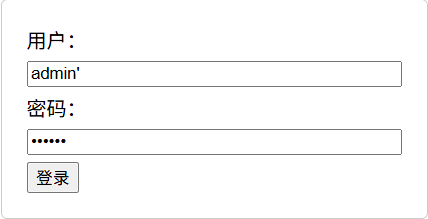
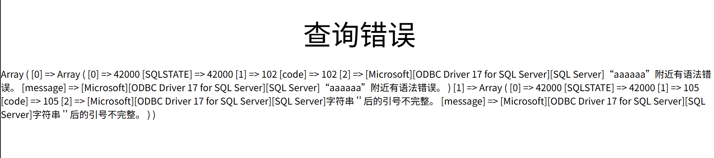

# 一个sql注入的实验模板

### 前言：做这个项目的起因大抵是因为老师给的sql注入材料用的是asp和一个非常古老的叫超级小飞侠的软件（希望学习别再用这种清朝软件了）。首先xxt对于这种软件可能是有什么限制，反正就总是报毒。而且有的人就算下载下来了也不会配置服务。而且我想着反正对web有点兴趣就干脆学了下PHP,HTML,JS然后自己写了这个模板。服务呢用的是vscode的php服务插件，反正比配置那个软件方便——2025/4/3

---

## 项目简介：分为safe与unsafe两个文件夹。其中unsafe文件夹里的php与html代码对提交的表单信息没有任何处理。而safe里的html代码对提交表单的字符串长度的字符类型进行了限制，php代码使用预处理查询保证sql注入失效。

### unsafe:

- 简单的登录界面（只能输入用户名和密码），而且不限制输入字符，方便初学者使用。

- 返回构造的sql语句和sqlserver错误信息，帮助初学者构造payload。

- 使用windows身份验证连接数据库，保证权限足够大。
  
  
  
  

### safe:

- 限制输入字段长度与类型

- 不返回错误信息，而且使用预处理查询，完全防范了sql注入的可能性

---

## 日志：

2025/4/7:完成所有代码，课程实验报告也交了，[实验报告在此](实验报告.doc)，要是有需要也可以下下来看看注入的手段。其实我第一次尝试所有注入方法的时候也挺惊讶的，才知道原来sql注入这么恐怖。之前也只在攻防世界这种平台试过，也不过只是找找标志这种，没想到连数据库种类和版本也可以获取。

